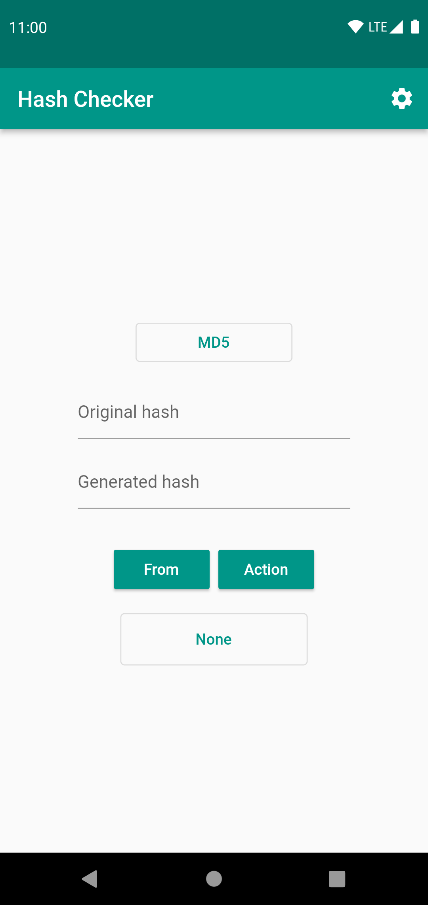
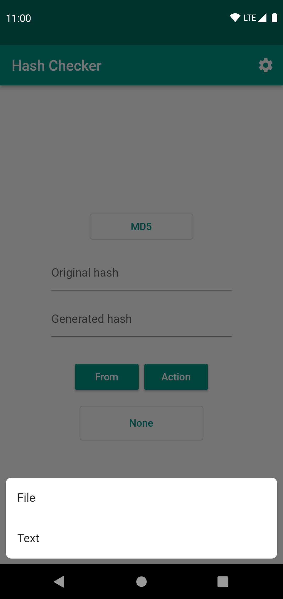
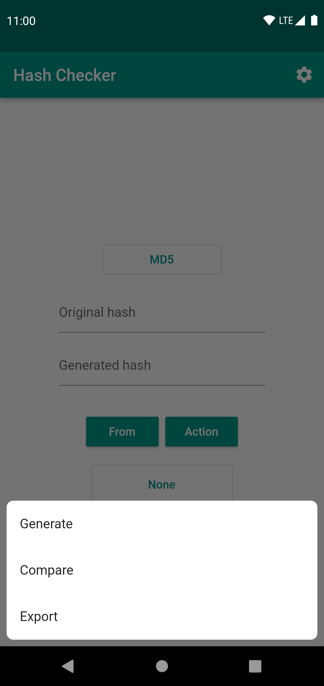
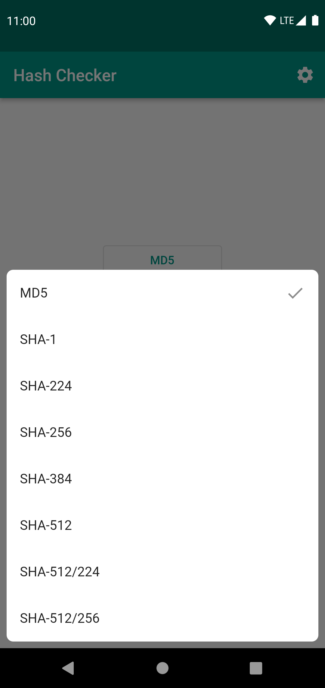
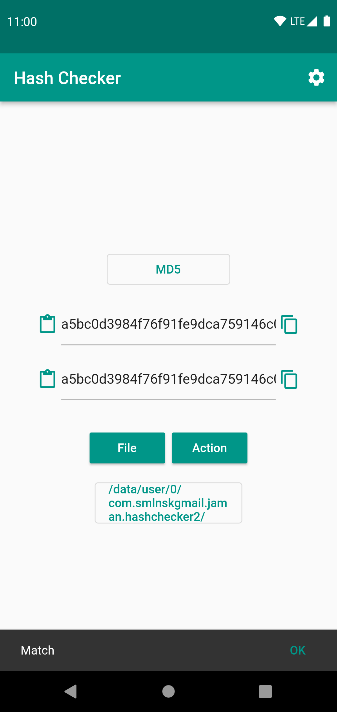
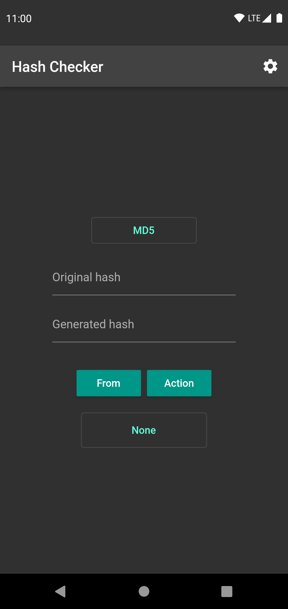
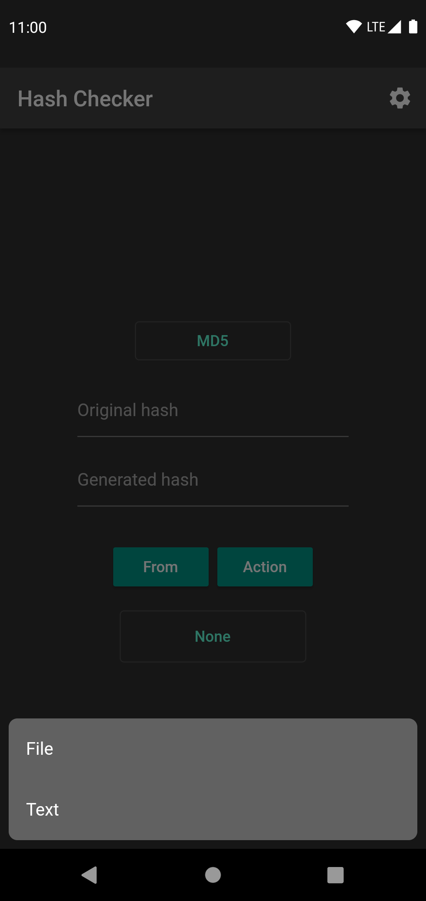
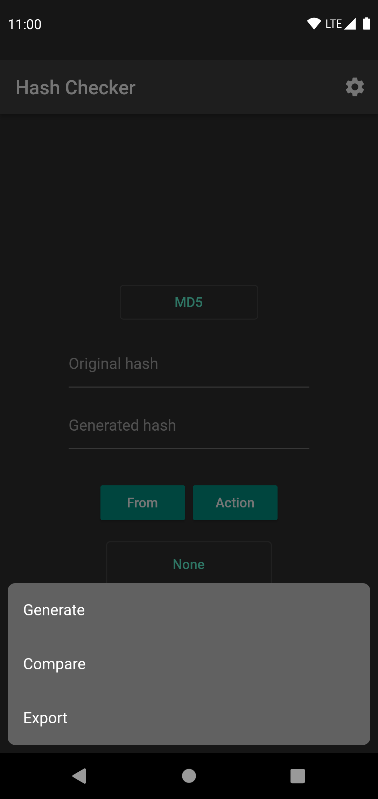
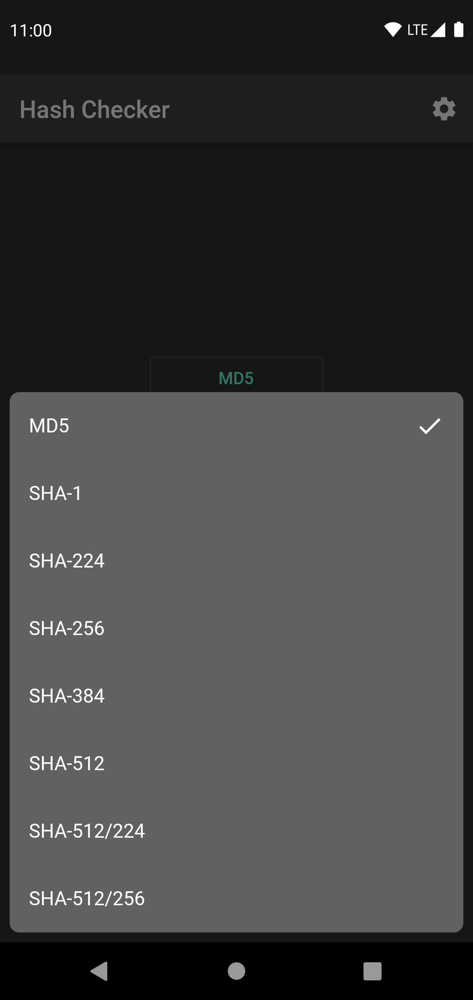
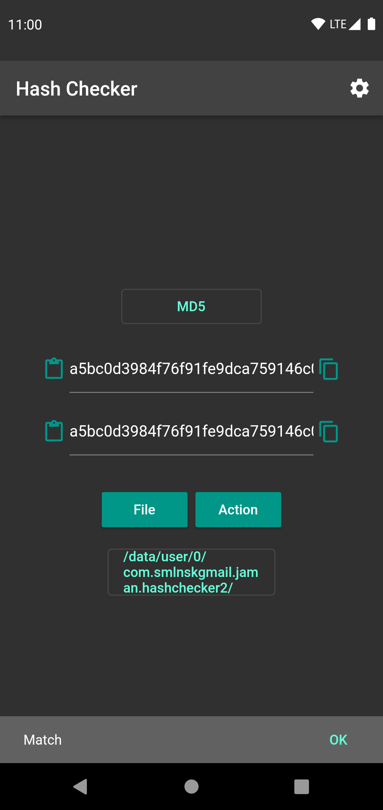

# Hash Checker 2

## About application

Fast and simple application that allows you to generate and compare hashes from files and text.

## Why this app exists when we have [Hash Checker](https://github.com/hash-checker/hash-checker)?

Because original Hash Checker app sometimes is hard to maintain and second app can build for many popular platforms from
one code base. Flutter framework is fast and stable, so it is a good choice for cross-platform solutions like this.
Original app is still maintaining and will not be archived in near future.

## Stack

| Component     | Plugin                                  | Motivation                                                                                                             |
|---------------|-----------------------------------------|------------------------------------------------------------------------------------------------------------------------|
| State manager | [MobX](https://pub.dev/mobx)            | Because it is simple, reactive, and easy to use. [BLoC](https://pub.dev/bloc) is very complex to small apps like this. |
| Navigation    | [AutoRoute](https://pub.dev/auto_route) | Because it has code generation structure and easy to use.                                                              |
| DI            | [Provider](https://pub.dev/provider)    | Because it is simple to configure and more comfortable than [GetIt](https://pub.dev/get_it).                           |

## Algorithms

| Name                                               | Since version | Status       |
|----------------------------------------------------|---------------|--------------|
| [MD5](https://en.wikipedia.org/wiki/MD5)           | 1.0.0         | `Supporting` |
| [SHA-1](https://en.wikipedia.org/wiki/SHA-1)       | 1.0.0         | `Supporting` |
| [SHA-224](https://en.wikipedia.org/wiki/SHA-2)     | 1.0.0         | `Supporting` |
| [SHA-256](https://en.wikipedia.org/wiki/SHA-2)     | 1.0.0         | `Supporting` |
| [SHA-384](https://en.wikipedia.org/wiki/SHA-2)     | 1.0.0         | `Supporting` |
| [SHA-512](https://en.wikipedia.org/wiki/SHA-2)     | 1.0.0         | `Supporting` |
| [SHA-512/224](https://en.wikipedia.org/wiki/SHA-2) | 1.0.0         | `Supporting` |
| [SHA-512/256](https://en.wikipedia.org/wiki/SHA-2) | 1.0.0         | `Supporting` |

## Languages

| Name    | Since version | Status       |
|---------|---------------|--------------|
| English | `1.0.0`       | `Translated` |

## Screenshots

### Android

#### Light

<br/>
<p align="center">
  
  
  
  
  
</p>

#### Dark

<br/>
<p align="center">
  
  
  
  
  
</p>

### iOS

Soon.

## How to use

### Articles

| Name                                                                                                                                                                               | Language |
|------------------------------------------------------------------------------------------------------------------------------------------------------------------------------------|----------|
| [How to calculate the hash of a file or create custom Hash on Android](https://www.how2shout.com/how-to/how-to-calculate-the-hash-of-a-file-or-create-custom-hash-on-android.html) | English  |

## Privacy Policy

- [Web version](https://hash-checker.github.io/hash-checker-2-privacy-policy.io/)

## Feedback

If you have any question or feature idea for app, you can open issue on this page or contact me by email
jaman.smlnsk@gmail.com.

## How to contribute

Before commit, read Commit Convention. Make sure your build is green before you contribute your pull request. Then:

```shell
$ flutter analyze
```

## Contributors

| Name             | Link to GitHub Account              | Notes |
|------------------|-------------------------------------|-------|
| Artem Fomchenkov | [fartem](https://github.com/fartem) |       |
